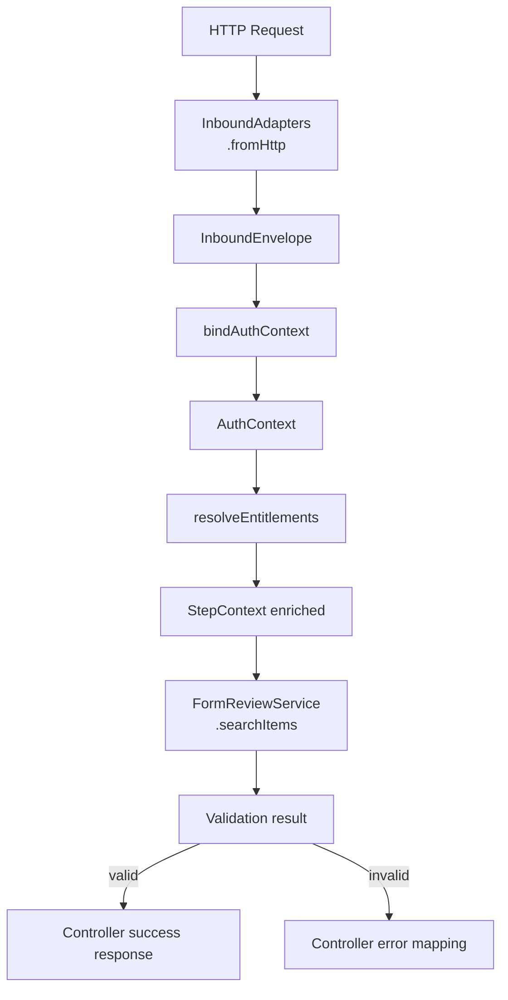

# `InboundFlow` 組裝示範（`Controller` 慣例）

本篇示範 **`eip-inbound` 在 `Controller` 層的正確使用方式**：  
Controller 不組裝流程，只持有一條**已完成組裝的 `InboundFlow`**；  
流程的定義集中在 `UtilityClass`，作為**可重用、可測試、可替換的流程描述**。

---

## 一、`InboundFlow` 的角色定位

在 `eip-inbound` 中：

- `InboundFlow<T>` 是一條 **宣告式流程描述**
    
- 它描述「資料如何被接住、補齊語意、進入用例」
    
- **不是 request scope，也不是 runtime 組裝物**
    

因此：

> `InboundFlow` 應該在 Controller 建構時完成組裝，  
> 而不是在 handler method 中臨時拼裝。

---

## 二、`InboundFlow` 組裝位置與命名慣例

### 放置位置

- 與 Controller 同一 bounded context
    
- 不放在 Controller、不放在 Service
    
- 命名為 `XxxInboundFlows`
    

### 範例

```java
@UtilityClass
public class FormReviewInboundFlows {
    public InboundFlow<ItemSearchRequest> itemSearchInboundFlow(...) { ... }
}
```

- **複數類名**：表示「此模組可能有多條 inbound 流程」
    
- **單數方法名**：一個方法回傳一條流程
    

---

## 三、`InboundFlow` 組裝示範（標準寫法）

```java
@UtilityClass  
public class FormReviewInboundFlows {  
  
    public InboundFlow<ItemSearchRequest> itemSearchInboundFlow(  
            FormReviewService service, Supplier<Validation<Violations, Authentication>> authSupplier,  
            EntitlementsResolver entitlementsResolver) {  
        return envelope -> InboundFlows.stateless(envelope)  
                .flatMap(AuthBindingSteps.<ItemSearchRequest>bindAuthContext(  
                        AuthBindingSteps.AuthCondition.required(), authSupplier, 
                        FormReviewInboundFlows::getAuthContext)::execute)  
                .flatMap(AuthBindingSteps.<ItemSearchRequest>resolveEntitlements(
                        AuthBindingSteps.AuthCondition.required(),
                        entitlementsResolver)::execute)  
                .flatMap(service::searchItems); // ✅ service 直接吃 StepContext       
	}  
  
    private static AuthContext getAuthContext(Authentication a) {  
        return GeneralBuilders.supply(AuthContext::new)  
                .with(WriteOperations.set(AuthContext::setPrincipalId,   
                        AuthContextExtractors.principalId(a)))  
                .with(WriteOperations.set(AuthContext::setAuthorities,   
                        AuthContextExtractors.authorities(a)))  
                .with(WriteOperations.set(AuthContext::setRoles,   
                        AuthContextExtractors.rolesFromAuthorities(a)))  
                .with(WriteOperations.set(AuthContext::setRoleGroups,   
                        AuthContextExtractors.scopesFromAuthorities(a)))  
                .build();  
    }  
  
}
```

---

## 四、為什麼這樣組裝？（設計說明）

### 1️⃣ 為什麼 `authSupplier` / `entitlementsResolver` 要外部注入？

因為它們代表的是 **「外部世界的資料來源」**：

- HTTP security
    
- batch job
    
- 測試 stub
    
- `mock` / `denyAll` / `readOnly`
    

`InboundFlow` 本身 **不應綁定任何具體取得方式**。

---

### 2️⃣ 為什麼不用 `SecurityContextHolder`？

因為那會讓流程：

- 綁死 `servlet thread`
    
- 綁死 `security filter`
    
- 無法在非 `HTTP` 情境重用
    
- 測試只能靠 `mock static`
    

> `eip-inbound` 的流程應該是 **純描述，不感知執行環境**

---

### 3️⃣ 為什麼用 `GeneralBuilders / WriteOperations` 建構 `AuthContext`？

這是刻意的語法選擇：

- 流程中的每一步，都是「宣告式套用」
    
- 不混入 `new + setter` 的命令式雜訊
    
- 保持與 pipeline 語法的一致性
    

讀起來像：

> 「在這個步驟，我宣告我要產生一個 `AuthContext`，並設定這些欄位」

而不是：

> 「我在這裡偷偷 `new` 了一個物件」

---

## 五、`InboundFlow` 與 `Controller` 的責任邊界（對照表）

| 角色            | 負責什麼                                                    | 不負責什麼                       |
| ------------- | ------------------------------------------------------- | --------------------------- |
| `Controller`  | HTTP → InboundEnvelopeInboundFlow 呼叫HTTP status mapping | 流程組裝權限判斷業務邏輯                |
| `InboundFlow` | 認證綁定權限補齊呼叫用例                                            | `HTTP statusResponse shape` |
| Service       | 業務用例                                                    | HTTP / Security / Meta      |

---

## 六、整體流程圖（Mermaid）

> 可直接貼在 README / docs



---

## 七、總結

> `InboundFlow` 是一條「如何進入系統」的描述，  
> `Controller` 只是把門打開，讓資料走進來、走出去。
> 
> 門不該決定怎麼走，  
> 路線也不該知道門在哪。

---
