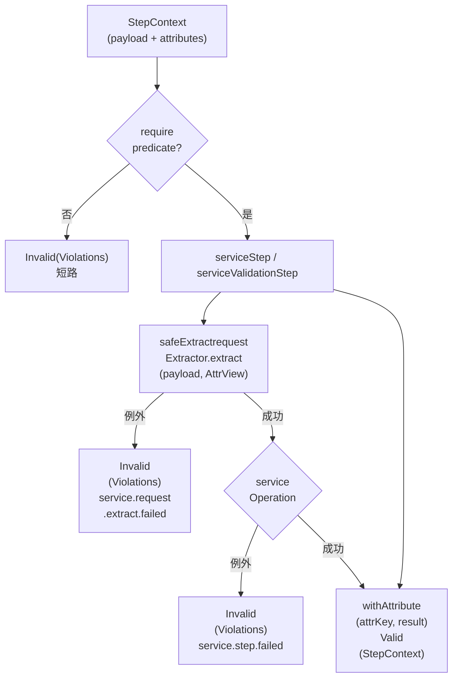
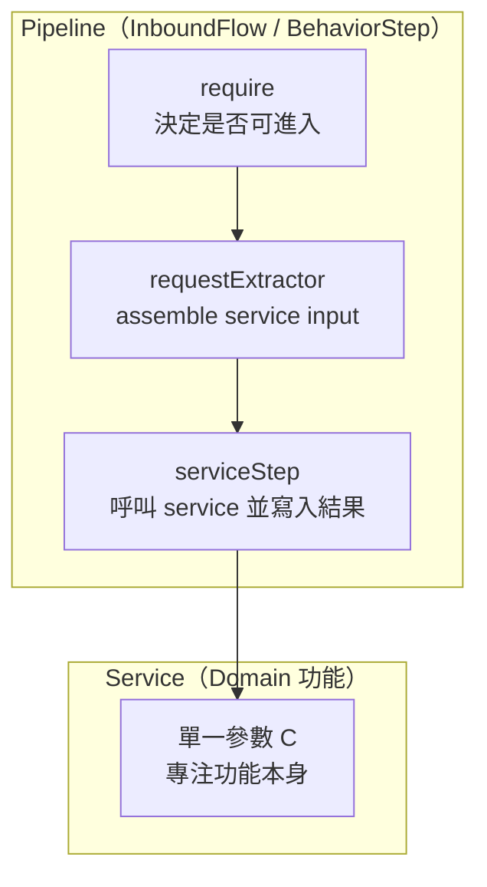

# `ServiceChainSteps`

`ServiceChainSteps` 是一組用於 **`BehaviorStep pipeline`** 的輕量工具，目的在於：

- 讓 **`Controller / InboundFlow`** 以「宣告式」方式串接 service methods
- 讓 service 維持 **單一參數（domain input）**，不暴露 `StepContext`
- 把流程中的「前置條件判斷」與「服務參數組裝」拆開，形成穩定的組裝語法

本文件聚焦在 `ServiceChainSteps` 的責任邊界、使用模式、與錯誤語意。

---

## 設計主線：predicate → assemble → service

在 pipeline 中，我們將 service 呼叫拆成兩段：

1. **predicate（require / gate）**  
   在進入 `service` 前，先確認某些條件已成立（例如：已完成授權、已解析 `entitlement`、已存在必要 `attrs`）。不成立則回傳 `Validation.invalid(Violations)`，流程短路。

2. **assemble（`requestExtractor`）**  
   使用 `payload + AttrView` 於呼叫點組裝 `service input`（`domain request`）。

3. **service（`serviceOperation`）**  
   service 只專注功能本身，不處理「誰可以做」與「缺料」。

這三者的拆分讓 `pipeline` 能維持「決策與功能分離」，並且避免把中介層（`attrs / context`）當成 `domain` 模型傳遞。

---

## 核心概念

### `StepContext` 與 `Attributes`

- `StepContext<T>` 持有 `payload` 與 attributes（`pipeline` 暫存資料）
- `attributes` 不應跨越 `service boundary`；`service` 不應依賴 `StepContext`

### `AttrView`：以能力而非容器存取 `attrs`

```java
@FunctionalInterface
public interface AttrView {
    Maybe<Object> get(AttrKey<Object> attrKey);
}
````

- `AttrView` 是「取用能力」，不是「已整理好的 `attrs` 容器」
    
- 使用 `Maybe<Object>` 明確表達：attribute **可能不存在**
    
- 抽象方法非泛型，避免 Java 對泛型 SAM 的推斷限制，並可安全使用 method reference（例如 `stepContext::findAttribute`）
    

### `ServiceRequestExtractor`：組裝 service 單參數

```java
@FunctionalInterface
public interface ServiceRequestExtractor<T, C> {
    C extract(T payload, AttrView attrView);
}
```

- `T`：payload 型別
    
- `C`：service input（domain request / context）
    
- extractor 的責任是「組裝」，不是「檢查缺料」
    
- 缺料應由 `require(...)` 先 gate（避免用 `.get()` 丟例外）
    

---

## 流程概念圖（Mermaid）



## 責任分層圖（Mermaid）




## API 說明

### `require(predicate, violationsExtractor)`

```java
public <T> BehaviorStep<T> require(
        Predicate<StepContext<T>> predicate,
        Extractor<StepContext<T>, Violations> violationsExtractor) {

    return sc -> Validation.<Violations, StepContext<T>>valid(sc)
            .filter(predicate, () -> violationsExtractor.extract(sc));
}
```

- 只做 gate，不做組裝、不呼叫 service
    
- violations 使用 supplier lazy 計算，僅在 predicate 失敗時建立錯誤
    
- 適合放在 pipeline 前段，集中處理「缺料」「權限」「流程前置條件」
    

---

### `serviceStep(requestExtractor, Function<C,R>, attrKey)`

```java
public <T, C, R> BehaviorStep<T> serviceStep(
        ServiceRequestExtractor<T, C> requestExtractor,
        Function<C, R> serviceOperation, AttrKey<R> attrKey) { ... }
```

語意：

1. `safeExtract` 先把 extractor 轉成 `Validation<Violations, C>`
    
2. extractor 失敗 → `service.request.extract.failed`
    
3. extractor 成功 → 執行 serviceOperation
    
4. service throw → `service.step.failed`
    
5. 成功 → 把結果寫入 `attrKey`
    

> 注意：serviceStep 的 `serviceOperation` 是「會 throw 的純函式」型態；例外會被轉成 violations。

---

### `serviceValidationStep(requestExtractor, Function<C, Validation<...>>, attrKey)`

```java
public <T, C, R> BehaviorStep<T> serviceValidationStep(
        ServiceRequestExtractor<T, C> requestExtractor,
        Function<C, Validation<Violations, R>> serviceOperation,
        AttrKey<R> attrKey) { ... }
```

語意：

- extractor 仍由 `safeExtract` 保護
    
- `serviceOperation` 自行回傳 `Validation`（不把 domain errors 轉成 exception）
    
- 成功時將 R 寫入 `attrKey`
    

---

## 錯誤語意（error codes）

`ServiceChainSteps` 將錯誤分層，避免混淆：

- `service.request.extract.failed`  
    表示 `requestExtractor` 組裝 service input 時發生例外（通常是 extractor 寫法不當或不該出現的缺料）。
    
- `service.step.failed`  
    表示 `serviceOperation` 執行時 throw exception（系統錯誤或未預期狀況）。
    

> 推薦規約：**缺料應由 require 先擋下**，extractor 不以 throw 表達缺料。

---

## 最小使用範例

### 1) 先 require，再呼叫 service（predicate → assemble → service）

```java
InboundFlows.stateless(envelope)
    .flatMap(ServiceChainSteps.require(
        sc -> sc.findAttribute(VISIBILITY_SCOPE).isPresent(),
        sc -> Violations.violate("attr.missing", "Missing visibility scope")
    )::execute)
    .flatMap(ServiceChainSteps.serviceStep(
        (payload, av) -> new ItemSearchInput(
            payload,
            (VisibilityScope) av.get(VISIBILITY_SCOPE).get() // 已由 require 保證存在
        ),
        service::search,
        AttrKeys.SEARCH_RESULT
    )::execute);
```

重點：

- `require` 負責「缺料與前置條件」
    
- extractor 可以假設條件已成立，避免在 extractor 內散落缺料處理
    
- service 只接收 `ItemSearchInput`（單一參數）

---

### 2) service 自行回 Validation（domain errors 不靠 exception）

```java
.flatMap(ServiceChainSteps.serviceValidationStep(
    (payload, av) -> new UpdateInput(payload, (UserId) av.get(USER_ID).get()),
    service::update,             // Function<UpdateInput, Validation<Violations, UpdateResult>>
    AttrKeys.UPDATE_RESULT
)::execute);
```

---

## 設計規約（team guideline）

1. **誰可以做（授權/條件）在 pipeline，service 專注功能**  
    `require(...)` 先 gate；service 不處理 policy。
    
2. **缺料不要靠 exception 表達**  
    缺料用 `require` + violations；extractor 不應靠 `.get()` 製造例外。
    
3. **`Attrs` 不跨越 service boundary**  
    service input 必須是 domain type（C），而不是 `StepContext` 或 `raw attrs map`。
    
4. **`AttrView` 是能力，不是容器**  
    不要把 `AttrView` 存進 attributes 作為「資料」；使用點即取即用即可。

在本架構中：

- Service 回傳 Validation<Violations, R>，表示「功能結果」或「領域層可判斷的失敗」。

- Controller / InboundFlow（pipeline） 負責把 service 的結果 寫回 StepContext（例如 withAttribute(attrKey, r)），以便後續步驟繼續組裝、路由、或最終輸出。

因此：

> StepContext 可被視為 控制器（或 inbound pipeline）在單次請求生命週期內的「步驟過程狀態」（process state / orchestration state）。
它承載的是流程協調所需的暫存資料與中介結果，而不是 domain entity 的持久狀態。

重要界線

- StepContext 的存在目的在於 控制流程：前置條件、組裝、路由、聚合、輸出。

- Service 專注於 功能本身，輸入為單一 domain request（C），輸出為 Validation<Violations, R>。

- StepContext 不應跨越 service boundary、也不應被當作可長期保存/重放的資料模型（除非另行投影成明確 DTO/event）。

> StepContext = Controller 的 orchestration state（流程狀態）
> ServiceResult = Domain 的 functional result（功能結果）

---

## FAQ

### Q: 為什麼 AttrView 用 `Maybe<?>` 而非泛型 `<A> Maybe<A>`？

A: 抽象方法若是泛型 method，在 Java 的 lambda/method reference 推斷上更容易遇到限制；改成 `Maybe<Object> get(AttrKey<Object>)` 可穩定以 `stepContext::findAttribute` 作為方法參考，同時保留「可能不存在」語意。型別由 `AttrKey` 與使用端規約承擔。

### Q: extractor 取 `attrs` 仍要 cast，怎麼辦？

A: 推薦做法是由 `require` 先 gate 需要的 key，讓 extractor 可以直接取用；若需要更好的型別體驗，可在 `AttrKey` 或工具層提供 typed helper（例如 `Attrs.getTyped(av, KEY)`）集中 cast。

---

## 相關文件

- `Validation`：`filter / map / flatMap` 的語意
    
- `InboundFlow / BehaviorStep pipeline`：step 的串接與短路模型
    
